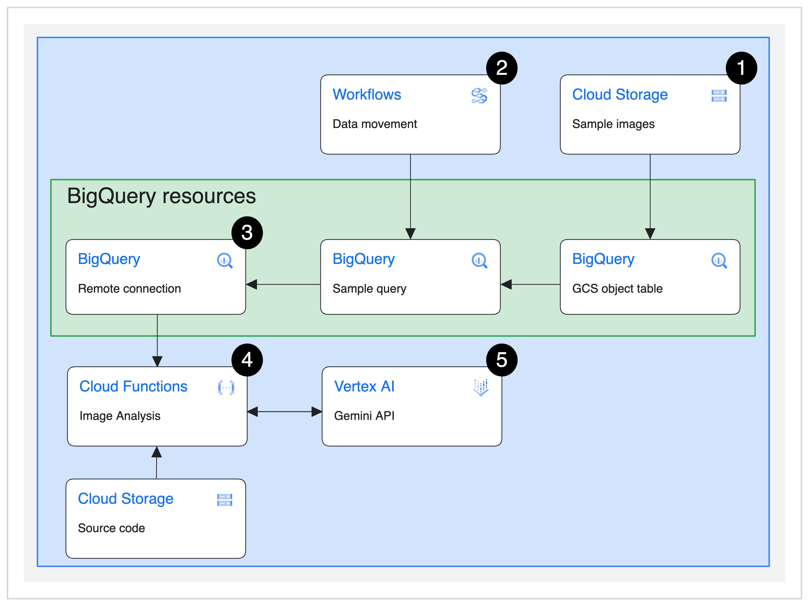
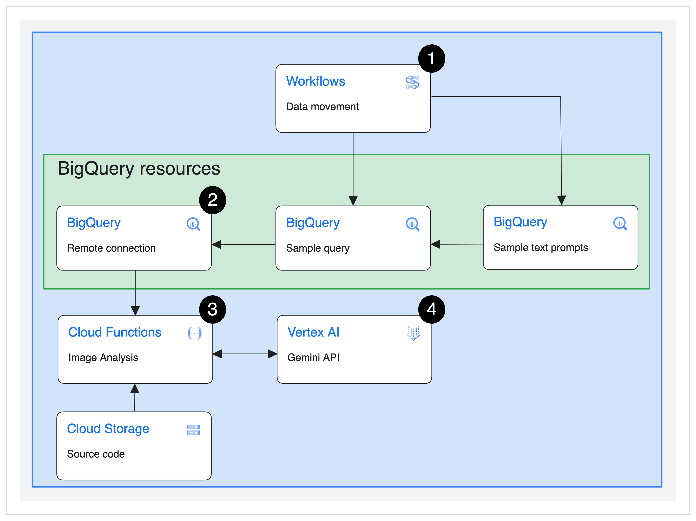

# Analyzing images and text with Gemini using BigQuery & Remote Functions

This repo provides an example of how to use [Gemini](https://blog.google/technology/ai/gemini-api-developers-cloud/), Google's largest and most capable AI model, through the [Vertex AI Gemini API](https://cloud.google.com/vertex-ai/docs/generative-ai/start/quickstarts/quickstart-multimodal) to analyze your BigQuery data. BigQuery and Remote Functions can be used to analyze images and text input using the [Vertex AI Gemini API](https://cloud.google.com/vertex-ai/docs/generative-ai/start/quickstarts/quickstart-multimodal) on Google Cloud. The following instructions should help you get started.

Before you start: Though using a new GCP project for this example is not a requirement, it might be easiest to use a new GCP project for this. This makes cleanup much easier, as you can delete the whole project to ensure all assets are removed and it ensures no potential conflicts with existing resources. You can also remove resources by running `terraform destroy` after you deploy the resources, but it will also disable the associated APIs.

# Architecture Diagrams

## Image analysis
<p align="center">
  
</p>

<ol>
  <li>Sample images are uploaded to a Cloud Storage bucket and a GCS object table is created in BigQuery</li>
  <li>Cloud Workflows creates a stored procedure in BigQuery that contains the sample query, which references the object table created in step 1 to pass images to the remote function for analysis using the Vertex AI Gemini API</li>
  <li>The stored procedure from step 2 is used to invoke the Cloud Function through a BigQuery connection</li>
  <li>The Cloud Function analyzes the sample images by passing them to the Vertex AI Gemini API (step 5) to get a brief description of the sample images and returns results from the Vertex AI Gemini API as query results</li>
</ol>

## Text analysis
<p align="center">
  
</p>
<ol>
  <li>Cloud Workflows creates a stored procedure in BigQuery that contains the sample query and provisions the <code>sample_text_prompts</code> table, which contains sample text prompts to describe various landmarks. The sample query passes these prompts to the remote function for analysis using the Vertex AI Gemini API</li>
  <li>The stored procedure from step 2 is used to invoke the Cloud Function through a BigQuery connection</li>
  <li>The Cloud Function analyzes the text input from the sample text by passing them to the Vertex AI Gemini API (step 4) to get generate a text response to each prompt and returns results from the Vertex AI Gemini API as query results</li>
</ol>

# Pricing Estimation
Installing this demo (by running `terraform apply` in the Cloud Shell CLI) and running the stored stored procedures for text and image analysis 4 times each day will cost approximately $0.06 USD per month. See the [Google Cloud Pricing Calculator](https://cloud.google.com/products/calculator/#id=d3f64c61-9afb-4467-a6af-2bdd9540d489) for more details. The total monthly cost will vary as your usage varies, including how often you deploy and teardown this demo.

**NOTE**: Charges for Multimodal model consumption in Vertex AI take effect on January 15, 2024. We estimate running this demo 4 times per day will increase the total cost by *$3.73 USD per month*. See the [Vertex AI pricing page for Generative AI](https://cloud.google.com/vertex-ai/pricing#generative_ai_models) for full details. Below is a breakdown of this estimate:
<ul>
  <li>Text analysis</li>
    <ul>
      <li>$0.02/month for Text Input</li>
      <li>$0.23/month for Text Output</li>
    </ul>
  <li>Image analysis</li>
    <ul>
      <li>$3.30/month for Image Input</li>
      <li>$0.18/month for Text Output</li>
    </ul>
</ul>

Keep in mind that generative AI models like Gemini are non-deterministic, so associated costs will vary based on the output length and cannot be definitively estimated.

## What can you do?
This deploys 2 Cloud Functions and connects them to BigQuery. One function takes an image from GCS as an input and uses the [Vertex AI Gemini API](https://cloud.google.com/vertex-ai/docs/generative-ai/start/quickstarts/quickstart-multimodal) to create a brief description of it. The other takes text in a BigQuery table as an input and generates a response. This demo deploys all the necessary sample data to help you get started as easily as possible.

After you deploy the resources, you can simply navigate to the BigQuery console and invoke the `image_query_remote_function_sp` stored procedure or the `text_query_remote_function_sp` stored procedure to get started.

# Deploying the infrastructure
## Setup
### 0. Clone this repo in Cloud Shell
#### 1. You'll need to set your Google Cloud project in Cloud Shell, clone this repo locally first, and set the working directory to this folder using the following commands.
```
gcloud config set project <PROJECT ID>
git clone https://github.com/shanecglass/gemini-remote-function
cd gemini-remote-function
```
#### 2. Enable the Cloud Resource Manager API
Check to make sure the [Cloud Resource Manager API](https://console.cloud.google.com/apis/library/cloudresourcemanager.googleapis.com) is enabled

### 1. Setup your infrastructure
This app uses Vertex AI, Cloud Functions, BigQuery, and more. Run the following to execute the Terraform script to setup everything.

#### 1. Intialize Terraform
First, initialize Terraform by running
```
terraform init
```

#### 2. Create the terraform.tfvars file and open it:
```
touch ./terraform.tfvars
nano ./terraform.tfvars
```

#### 3. Copy and paste the following code snippet.
Edit the values for the required variables, save the file, and exit.

```
# This is an example of the terraform.tfvars file.
# The values in this file must match the variable types declared in variables.tf.
# The values in this file override any defaults in variables.tf.

# ID of the project in which you want to deploy the solution
project_id = "PROJECT_ID"

# Google Cloud region where you want to deploy the solution
# Example: us-central1
region = "REGION"

# Whether or not to enable underlying apis in this solution.
# Example: true
enable_apis = true

# Whether or not to protect BigQuery resources from deletion when solution is modified or changed.
# Example: false
force_destroy = false

# Whether or not to protect Cloud Storage resources from deletion when solution is modified or changed.
# Example: false
deletion_protection = false
```
#### 4. Verify that the Terraform configuration has no errors
Run the following:
```
terraform validate
```
If the command returns any errors, make the required corrections in the configuration and then run the terraform validate command again. Repeat this step until the command returns `Success! The configuration is valid.`

#### 5. Review resources
Review the resources that are defined in the configuration:
```
terraform plan
```

#### 6. Deploy the Terraform script

```
terraform apply
```

When you're prompted to perform the actions, enter `yes`. Terraform displays messages showing the progress of the deployment.

If the deployment can't be completed, Terraform displays the errors that caused the failure. Review the error messages and update the configuration to fix the errors. Then run `terraform apply` command again. For help with troubleshooting Terraform errors, see [Errors when deploying the solution using Terraform](https://cloud.google.com/architecture/big-data-analytics/analytics-lakehouse#tf-deploy-errors).

After all the resources are created, Terraform displays the following message:
```
Apply complete!
```

The Terraform output also lists the following additional information that you'll need:
- The link to open the BigQuery editor to invoke the `image_query_remote_function_sp` stored procedure
- The link to open the BigQuery editor to invoke the `text_query_remote_function_sp` stored procedure

# 2. **Analyze your data!**
## Analyzing images
From here, click on the `bigquery_editor_image_sp` URL in your Terraform outputs to start! Gemini will analyze the landmark images when you invoke the stored procedure through the Vertex AI Gemini API. Simply click `Invoke stored procedure` for the `image_query_remote_function_sp` stored procedure that loads when you click the URL, then click `Run` for the resulting query to get the image descriptions generated by Gemini through your Remote Function.
<p align="center">
  
</p>

## Analyzing text prompts
The process for analyzing text prompts is very similar. Click on the `bigquery_editor_text_sp` URL in your Terraform outputs to start. Gemini will analyze the prewritten text prompts when you invoke the stored procedures through the Vertex AI Gemini API. Simply click `Invoke stored procedure` for the `text_query_remote_function_sp` stored procedure that loads when you click the URL, then click `Run` in the resulting query to get the responses generated by Gemini through your Remote Function.
<p align="center">
  
</p>

If you need to see your Terraform outputs again, simply enter `terraform output` into your command line.
